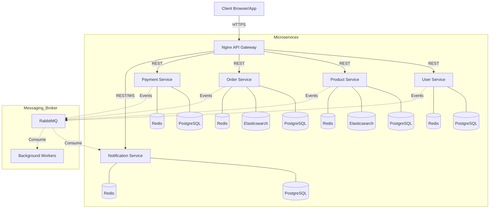

# MicroGreens

## System Overview
**MicroGreens** is a production-ready, scalable e-commerce platform designed for grocery and vegetable marketplaces. Built with a high-performance **Go** backend and a robust **Microservices Architecture**, the system ensures high availability, independent scalability, and real-time responsiveness. It integrates modern cloud-native patterns such as API Gateways, Event-Driven communication, and Search-optimized indexing.

## Architecture Design
The project follows a **Hexagonal Architecture (Ports and Adapters)** pattern within each service, ensuring that core business logic remains isolated from external infrastructure (databases, message brokers, APIs).

### Communication Patterns
- **Synchronous (REST & WebSocket):** Clients interact with the system via an **Nginx API Gateway**. For real-time updates (e.g., order status alerts), the **Notification Service** provides a WebSocket interface.
- **Asynchronous (Event-Driven):** Heavy or background tasks like Elasticsearch indexing, stock synchronization, and payment status updates are handled via **RabbitMQ** to ensure system reliability and decoupling.

### System Architecture Flow


## Service Catalog

| Service | Responsibility | Tech Stack | Default Port |
| :--- | :--- | :--- | :--- |
| **User Service** | Authentication (JWT), Profile Management, Role-Based Access Control (RBAC). | Go (Echo), Postgres, Redis | `8080` |
| **Product Service** | Catalog management, Categories, Inventory/Stock, Search optimization. | Go (Echo), Postgres, Redis, ES | `8081` |
| **Order Service** | Checkout flow, Order lifecycle management, Purchase history indexing. | Go (Echo), Postgres, Redis, ES | `8082` |
| **Payment Service** | Payment Gateway integration (Midtrans/Stripe), Webhooks, Transaction logging. | Go (Echo), Postgres, Redis | `8083` |
| **Notification Service** | Real-time notifications via WebSocket and persistent in-app alerts. | Go (Echo), Postgres, Redis | `8084` |

## Infrastructure & Middleware
- **API Gateway (Nginx):** Handles SSL termination, CORS, Rate Limiting, and centralized routing.
- **Message Broker (RabbitMQ):** Facilitates inter-service communication and background job processing.
- **Search Engine (Elasticsearch):** Powers high-speed product searches and complex order history queries.
- **Caching & Session (Redis):** Used for session management, request rate limiting, and performance optimization.
- **Storage:** Integrated with **Supabase Storage** (or AWS S3 compatible) for product images and user profile uploads.

## Setup & Installation

### Prerequisites
- Docker & Docker Compose
- Go 1.24+ (if running locally without Docker)

### 1. Environment Configuration
Each service contains an `.env.example` and `.env.docker.example`. Copy these to `.env` or `.env.docker`:
```bash
cp user-service/.env.docker.example user-service/.env.docker
# Repeat for all services (Product, Order, Payment, Notification)
```

### 2. Database Migrations
Run the database migrations using the dedicated Docker profiles:
```bash
docker-compose --profile migration up
```

### 3. Start the System
Launch the entire infrastructure and microservices:
```bash
# Start infrastructure and services
docker-compose up -d

# Start background workers (Optional/Recommended)
docker-compose --profile worker up -d

# Start search infrastructure (Elasticsearch)
docker-compose --profile search up -d
```

## API Documentation
Each service is equipped with **Swagger/OpenAPI** documentation. Once the services are running, you can access the documentation at the following endpoints (via the gateway):

- **User Service:** `http://localhost/api/v1/user/swagger/index.html`
- **Product Service:** `http://localhost/api/v1/product/swagger/index.html`
- **Order Service:** `http://localhost/api/v1/order/swagger/index.html`

Alternatively, you can find the raw Swagger JSON/YAML files within each service's `docs/` directory.

---
Developed and maintained by **[Jonathan Gunawan](https://github.com/JonathanGunawan30)**

[](https://github.com/JonathanGunawan30)
